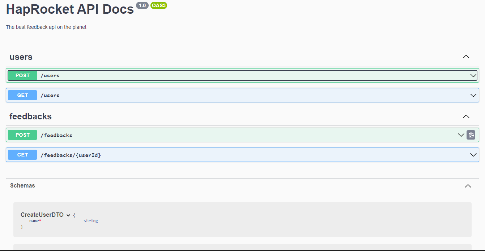

<h1 align="center">
    HapRocket API - The best feedback api on the planet.
</h1>

<p align="center">
  <a href="#definition">Definition</a> •
  <a href="#common-actions">Common actions</a> •
  <a href="#tools">Tools</a> •
  <a href="#good-practices-and-patterns">Good Practices</a> •
  <a href="#instalation-guide">Instalation guide</a> •
  <a href="#database-access">Database</a> •
  <a href="#swagger-documentation">Documentation</a>
</p>

## Definition
A WEB API to send feedback to other people.

### Common actions
- Create user
- Get users
- Create user feedback
- View all feedback by user

### Tools
- NODE.js 16 LTS
- Typescript
- NestJs
- Swagger documentation
- Prisma ORM
- Prisma Client
- SQLite

### Good Practices and Patterns
- Clean Architecture
- Domain Driven Design
- SOLID Principles
- Repository Pattern

### Instalation guide:

#### 1. Download the project with git:
```
git clone https://github.com/gabrielbugarelli/haprocket-api.git
```

#### 2. Download Yarn with NPM:
```
npm install --global yarn
```

#### 3. install the dependencies:
```
yarn install
```

#### 4. Run the application
```
yarn dev
```

#### The API will be raised on *port* 3333, with this, to consume just point to localhost:3333/endpoint.

### Database access
To access the database, simply run the command **npx prisma studio** in terminal and open the link http://localhost:5555/ in the browser.
```
npx prisma studio
```

### Swagger documentation
The entire project is documented in swagger, to access it, just access the API home route in the browser: **localhost:3333/**

<div align="center"> 
	
</div>
